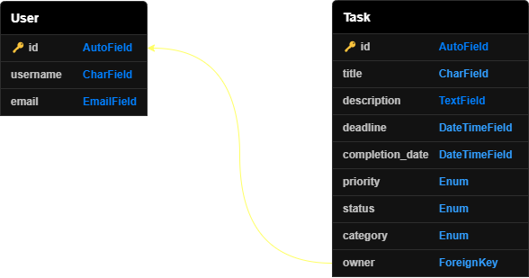

`ALX` `REST API` `PYTHON` `DJANGO` `POSTGRESQL`

# Task Manager API 

The Task Manager API is a backend application built with Django, designed to help users efficiently manage their tasks. This API provides functionality for users to create, update, and delete tasks, as well as mark them as complete or incomplete. It is developed with scalability and simplicity in mind, making it a great foundation for learning or expanding to more complex applications.

<!-- - [Key features](#key-features)
    - [Authentication](#authentication)
    - [Profile](#profile)
    - [Tasks Management](#tasks-management)
    - [Single Task management](#single-task-management)
- [Data Relationships](#data-relationships)
  - [Entity Relationship Diagram](#entity-relationship-diagram)
  - [Models](#models)
- [API Documentation](#api-documentation)
  - [Base URL](#base-url)
  - [Protected Requests](#protected-requests)
  - [Successful Responses](#successful-responses)
  - [Error Responses](#error-responses)
  - [Endpoints](#endpoints) -->

## Key features

### Authentication

- Registration of a new user account.
    - `username`, `email`, and `password` are required.
- Login to access the API.
    - `username` and `password` are required.
- JWT-based authentication for secure access.
    - A token is generated for authenticated users, it is required for all protected endpoints.

### Profile

- Get the current user's profile.
- Update user information.
- Delete a user account.

### Tasks Management

- Creation of tasks.
    - `title` is required.
    - `deadline` is must be in the future.
    - Only authenticated users can create tasks.
- Retrieval of tasks.
    - Filtering tasks by `status`, `priority`, and `category`.
    - Sorting tasks by `title`, `deadline`, `priority` in ascending or descending order.
    - Users can retrieve only their own tasks.

### Single Task management

- Retrieval of specific task details.
- Updation of task details.
    - Only tasks with status `PENDING` can be updated.
- Marking a task as complete or pending.
- Deletion of a task.


## Data Relationships

### Entity Relationship Diagram



### Models

<table>
    <thead>
        <tr>
            <th rowspan="2">Model</th>
            <th colspan="2">Attribute</th>
            <th colspan="7">Value</th>
        </tr>
        <tr>
            <th>Name</th>
            <th>Description</th>
            <th>Type</th>
            <th>Default</th>
            <th>Choices</th>
            <th>Unique</th>
            <th>Required</th>
        </tr>
    </thead>
    <tbody>
        <!-- User Model -->
        <tr>
            <td rowspan="3">User</td>
            <td><code>id</code></td>
            <td>ID</td>
            <td><code>AutoField</code></td>
            <td>-</td>
            <td>-</td>
            <td>✔️</td>
            <td>✔️</td>
        </tr>
        <tr>
            <td><code>username</code></td>
            <td>Username</td>
            <td><code>CharField</code></td>
            <td>-</td>
            <td>-</td>
            <td>✔️</td>
            <td>✔️</td>
        </tr>
        <tr>
            <td><code>email</code></td>
            <td>Email Address</td>
            <td><code>EmailField</code></td>
            <td>-</td>
            <td>-</td>
            <td>✔️</td>
            <td>✔️</td>
        </tr>
        <!-- Task Model -->
        <tr>
            <td rowspan="9">Task</td>
            <td><code>id</code></td>
            <td>ID</td>
            <td><code>AutoField</code></td>
            <td>-</td>
            <td>-</td>
            <td>✔️</td>
            <td>✔️</td>
        </tr>
        <tr>
            <td><code>title</code></td>
            <td>Task Title</td>
            <td><code>CharField</code></td>
            <td>-</td>
            <td>-</td>
            <td>❌</td>
            <td>✔️</td>
        </tr>
        <tr>
            <td><code>description</code></td>
            <td>Task Description</td>
            <td><code>TextField</code></td>
            <td>-</td>
            <td>-</td>
            <td>❌</td>
            <td>❌</td>
        </tr>
        <tr>
            <td><code>deadline</code></td>
            <td>Task Deadline</td>
            <td><code>DateTimeField</code></td>
            <td>-</td>
            <td>-</td>
            <td>❌</td>
            <td>❌</td>
        </tr>
        <tr>
            <td><code>completion_date</code></td>
            <td>Task Completion Date</td>
            <td><code>DateTimeField</code></td>
            <td>-</td>
            <td>-</td>
            <td>❌</td>
            <td>❌</td>
        </tr>
        <tr>
            <td><code>priority</code></td>
            <td>Task Priority</td>
            <td><code>CharField</code></td>
            <td><code>LOW</code></td>
            <td><code>LOW</code>, <code>MEDIUM</code>, <code>HIGH</code></td>
            <td>❌</td>
            <td>✔️</td>
        </tr>
        <tr>
            <td><code>status</code></td>
            <td>Task Status</td>
            <td><code>CharField</code></td>
            <td><code>PENDING</code></td>
            <td><code>PENDING</code>, <code>COMPLETED</code></td>
            <td>❌</td>
            <td>✔️</td>
        </tr>
        <tr>
            <td><code>category</code></td>
            <td>Task Category</td>
            <td><code>CharField</code></td>
            <td><code>UNCATEGORIZED</code></td>
            <td><code>WORK</code>, <code>PERSONAL</code>, <code>UNCATEGORIZED</code></td>
            <td>❌</td>
            <td>✔️</td>
        </tr>
        <tr>
            <td><code>owner</code></td>
            <td>Task Owner</td>
            <td><code>ForeignKey</code></td>
            <td>-</td>
            <td>-</td>
            <td>❌</td>
            <td>✔️</td>
        </tr>
    </tbody>
</table>


## API documentation

### Base URL

The base URL for the API is:

```YAML
https://tasks-management-api-python.onrender.com/api
```

### Protected requests

All requests to protected endpoints must include a valid JWT (JSON Web Token) in the Authorization header. If the token is missing, expired, or invalid, the request will be rejected with an appropriate error message.

```YAML
Authorization: Bearer <your-jwt-token>
```

If the token is missing, invalid, or expired, you will receive a 401 Unauthorized error response.

### Successful responses 

A successful request will return a 200 OK HTTP status along with a response body in the following format:

```json
{
    "data": {
        "field1": "value1",
        "field2": "value2",
        "field3": "value3"
    }
}
```

### Error responses

If the request cannot be processed due to errors (e.g., invalid data, unauthorized access, etc.), the API will return an appropriate error response. This will include a 4xx or 5xx HTTP status code and a structured response.

```json
{
    "error": "Error message"
}
```

### Endpoints

<table>
    <thead>
        <tr>
            <th rowspan="2">Group</th>
            <th rowspan="2">Description</th>
            <th colspan="3">Request</th>
            <th colspan="2">Response</th>
        </tr>
        <tr>
            <th>Method</th>
            <th>Endpoint</th>
            <th>Privacy</th>
            <th>✔️ Success</th>
            <th>❌ Failure</th>
        </tr>
    </thead>
    <tbody>
        <tr>
            <td rowspan="2">Authentication</td>
            <td>Registers a new user</td>
            <td><code>POST</code></td>
            <td><code>/auth/register</code></td>
            <td>🌐</td>
            <td><code>201</code> (Created)</td>
            <td><code>400</code> (Validation errors)<br><code>409</code> (User already exists)</td>
        </tr>
        <tr>
            <td>Logs in an existing user</td>
            <td><code>POST</code></td>
            <td><code>/auth/login</code></td>
            <td>🌐</td>
            <td><code>200</code> (Retrieved User & Token)</td>
            <td><code>400</code> (Missing credentials)<br><code>401</code> (Invalid credentials)</td>
        </tr>
        <tr>
            <td rowspan="3">Profile</td>
            <td>Retrieves user details</td>
            <td><code>GET</code></td>
            <td><code>/user</code></td>
            <td>🔒</td>
            <td><code>200</code> (Retrieved)</td>
            <td><code>404</code> (User not found)<br><code>401</code> (Unauthorized)</td>
        </tr>
        <tr>
            <td>Updates user information</td>
            <td><code>PUT</code></td>
            <td><code>/user</code></td>
            <td>🔒</td>
            <td><code>204</code> (Updated)</td>
            <td><code>400</code> (Validation errors)<br><code>404</code> (User not found)<br><code>401</code> (Unauthorized)</td>
        </tr>
        <tr>
            <td>Deletes user account</td>
            <td><code>DELETE</code></td>
            <td><code>/user</code></td>
            <td>🔒</td>
            <td><code>204</code> (Deleted)</td>
            <td><code>404</code> (User not found)<br><code>401</code> (Unauthorized)</td>
        </tr>
        <tr>
            <td rowspan="2">Tasks management</td>
            <td>Creates a new task</td>
            <td><code>POST</code></td>
            <td><code>/tasks</code></td>
            <td>🔒</td>
            <td><code>201</code> (Created)</td>
            <td><code>400</code> (Validation errors)<br><code>401</code> (Unauthorized)</td>
        </tr>
        <tr>
            <td>
                Retrieves list of tasks
                <br>Filters : <code>status</code>, <code>priority</code>, <code>category</code>.
                <br>Sorting : <code>title</code>, <code>-title</code>, <code>deadline</code>, <code>-deadline</code>, <code>priority</code>, <code>-priority</code>.
            </td>
            <td><code>GET</code></td>
            <td><code>/tasks</code></td>
            <td>🔒</td>
            <td><code>200</code> (Retrieved)</td>
            <td><code>400</code> (Invalid filter/sort value)<br><code>401</code> (Unauthorized)</td>
        </tr>
        <tr>
            <td rowspan="6">Single task management</td>
            <td>Retrieves specific task details</td>
            <td><code>GET</code></td>
            <td><code>/task/:id</code></td>
            <td>🔒</td>
            <td><code>200</code> (Retrieved)</td>
            <td><code>404</code> (Task not found)<br><code>401</code> (Unauthorized)</td>
        </tr>
        <tr>
            <td>Updates specific task details</td>
            <td><code>PUT</code></td>
            <td><code>/task/:id</code></td>
            <td>🔒</td>
            <td><code>204</code> (Updated)</td>
            <td><code>400</code> (Cannot edit completed task)<br><code>404</code> (Task not found)<br><code>401</code> (Unauthorized)</td>
        </tr>
        <tr>
            <td>Marks task as completed</td>
            <td><code>PUT</code></td>
            <td><code>/task/:id/complete</code></td>
            <td>🔒</td>
            <td><code>204</code> (Marked as Completed)</td>
            <td><code>400</code> (Already completed)<br><code>404</code> (Task not found)<br><code>401</code> (Unauthorized)</td>
        </tr>
        <tr>
            <td>Marks task as pending</td>
            <td><code>PUT</code></td>
            <td><code>/task/:id/pending</code></td>
            <td>🔒</td>
            <td><code>204</code> (Marked as Pending)</td>
            <td><code>400</code> (Already pending)<br><code>404</code> (Task not found)<br><code>401</code> (Unauthorized)</td>
        </tr>
        <tr>
            <td>Deletes specific task</td>
            <td><code>DELETE</code></td>
            <td><code>/task/:id</code></td>
            <td>🔒</td>
            <td><code>204</code> (Deleted)</td>
            <td><code>404</code> (Task not found)<br><code>401</code> (Unauthorized)</td>
        </tr>
    </tbody>
</table>
